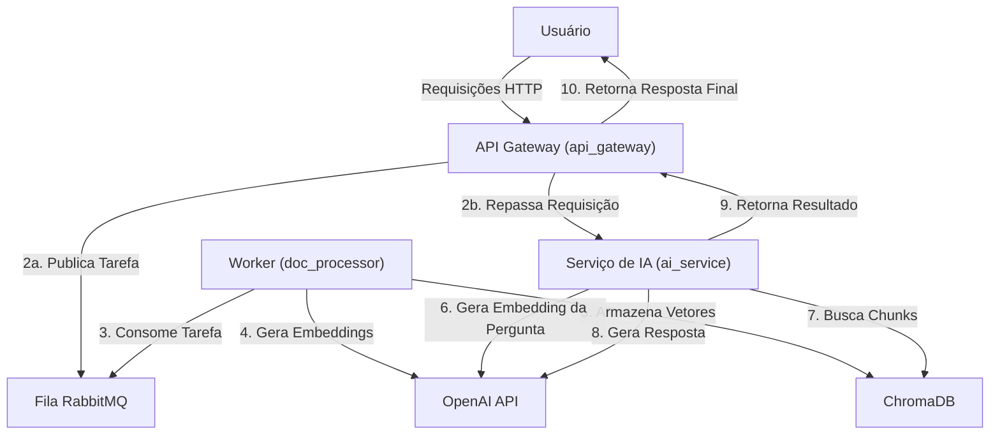

# Teste Prático - Cientista de Dados CGU


## Arquitetura da Solução

Para atender ao requisito de suportar até 10.000 usuários concorrente, a solução foi projetada utilizando uma **arquitetura de microsserviços containerizada com Docker**. Este padrão permite que cada funcionalidade principal do sistema opere de forma independente, garantindo o cumprimento dos requisitos de escalabilidade, performance, disponibilidade e segurança. A comunicação entre os serviços é realizada por meio de requisições HTTP síncronas e por um sistema de mensageria (RabbitMQ) para tarefas assíncronas.




### Componentes da Arquitetura.

A aplicação é composta pelos seguintes serviços independentes:

* **API Gateway (`api_gateway`)**
    * **Tecnologia:** FastAPI (Python)
    * **Responsabilidade:** Ponto de entrada único para todas as requisições externas. É responsável por receber as chamadas, validar os dados de entrada via Pydantic e atuar como um proxy, delegando as requisições para os serviços internos apropriados.

* **Fila de Mensagens (RabbitMQ)**
    * **Tecnologia:** RabbitMQ
    * **Responsabilidade:** Atua como broker de mensagens para operações assíncronas. Ao receber um upload de documento, o API Gateway publica uma tarefa na fila. Essa abordagem desacopla o processamento pesado da requisição inicial, otimizando o tempo de resposta ao usuário.

* **Worker de Processamento (`doc_processor`)**
    * **Tecnologia:** Celery, OpenAI API, ChromaDB Client (Python)
    * **Responsabilidade:** Serviço "worker" que consome as tarefas da fila do RabbitMQ.Executa o processamento intensivo de I/O e CPU: leitura de PDFs, divisão do texto em chunks, chamada à API da OpenAI para geração de embeddings e armazenamento dos vetores no ChromaDB.

* **Serviço de IA (`ai_service`)**
    * **Tecnologia:** FastAPI, OpenAI API, ChromaDB Client (Python)
    * **Responsabilidade:** Concentra a lógica de negócio relacionada à IA.
        * **Lógica RAG:** Processa requisições de busca, gerando o embedding da pergunta, consultando os chunks relevantes no ChromaDB e utilizando o modelo `gpt-3.5-turbo` para gerar uma resposta contextualizada. 
        * **Lógica de Classificação:** Realiza a classificação de sentimentos de um texto por meio da abordagem de "Tool Calling" da OpenAI.

* **Banco de Dados Vetorial (ChromaDB)**
    * **Tecnologia:** ChromaDB
    * **Responsabilidade:** Armazena os embeddings de texto e metadados relevantes. Foi escolhido por ser simples, e por prefência pessoal. Permite a criação de coleções separadas por usuário para garantir o total isolamento dos dados. 

### Atendendo aos Requisitos de Arquitetura

O design de microsserviços foi desenhado especificamente para cobrir os quatro pilares exigidos:

* **Escalabilidade** 
    * A arquitetura permite que cada serviço seja escalado de forma independente. Em caso de gargalo no processamento de documentos, pode-se aumentar o número de réplicas do `doc_processor` sem impactar os demais serviços, garantindo que o sistema possa lidar com o aumento de usuários e dados.

* **Performance**
    * A performance percebida pelo usuário é otimizada pelo processamento assíncrono. O endpoint de upload responde em milissegundos com o status `202 Accepted`, enquanto a tarefa pesada é executada em background para otimizar a eficiência e a velocidade das operações.

* **Disponibilidade**
    * O design de múltiplos serviços independentes evita um ponto único de falha. Em um ambiente orquestrado, a falha de um contêiner levaria à sua substituição automática, mantendo os serviços acessíveis com tempo de inatividade mínimo.

* **Segurança**
    * **Isolamento de Dados :** A principal medida de segurança implementada é o isolamento dos dados por usuário. Cada `user_id` possui uma coleção exclusiva no ChromaDB, o que impede o vazamento de informações entre usuários.
    * **Gerenciamento de Segredos:** Credenciais sensíveis, como a `OPENAI_API_KEY`, são gerenciadas por meio de variáveis de ambiente e não são armazenadas no código-fonte, protegendo dados e informações sensíveis contra ameaças.

## Decisões Técnicas

As escolhas de tecnologia foram feitas buscando um equilíbrio entre performance, custo, facilidade de implementação e robustez.

### 1. Modelo de Embedding
* **Escolha:** OpenAI `text-embedding-3-small`.
* **Justificativa:** Optou-se por este modelo por ser uma tarefa simples. Usei minha api_key pessoal, por ele ser mais econômico que a versão `-large` fiz a escolha por ele. Além disso, sua performancee é mais que suficiente para garantir uma recuperação de informação de alta qualidade para o sistema de RAG.

### 2. Banco Vetorial
* **Escolha:** ChromaDB.
* **Justificativa:** Foi escolhio por preferência pessoal, é uma ferramenta que utilizo no meu dia a dia. Também pensei em usar Opensearch, mas não conseguiria entregar em tempo.Ele oferece funcionalidades robustas de banco de dados, como a criação de coleções e armazenamento de metadados, permitindo uma implementação segura de isolamento de dados por usuário.

### 3. LLM/SLM (Geração e Classificação)
* **Escolha:** OpenAI `gpt-3.5-turbo`.
* **Justificativa:** Este modelo foi escolhido como o componente principal para geração de respostas (RAG) e classificação pela relação custo-benefício. Ele é mais rápido e mais barato que os modelos GPT-4, tornando a aplicação mais escalável e economicamente viável, sem um sacrifício significativo na qualidade das respostas para esse caso de uso. Afirmo isso baseado em experiência pessoal.

### Decisão Técnica de Classificação e Referência

A técnica de `logprobs` foi explorada, porém, não houve tempo hábil para concluir, então foi usada uma llm + tool.

## Como Executar Localmente

1.  **Pré-requisitos:**
    * Docker e Docker Compose instalados.
    * Copie o arquivo `ENV_TEMPALTE`, renomeie para `.env` na raiz do projeto.BM25

2.  **Configuração:**
    * Adicione sua chave da API da OpenAI ao arquivo `.env`:
        ```
        OPENAI_API_KEY='sk-...'
        ```

3.  **Execução:**
    * Na raiz do projeto, execute o comando para construir e iniciar os Containers:
        ```bash
        docker-compose up --build
        ```

4.  **Acesso aos Serviços:**
    * **Documentação da API (Swagger UI):** `http://localhost:8000/docs`
    * **Interface do RabbitMQ:** `http://localhost:15672` (login: `guest` / `guest`)

## Exemplos de Requisição
Os exemplos seguintes podem ser replicados via bash, mas também é possível verificar via swagger `http://localhost:8000/docs`.

### 1. Processar um Documento

```
curl -X POST "http://localhost:8000/processar-documentos" \
-F "user_id=usuario_teste_01" \
-F "arquivos=@/caminho/para/seu/arquivo.pdf"
```

### 2. Perguntar sobre documento processado, com o mesmo usuário.
É esperado termos a resposta.
```
curl -X POST "http://localhost:8000/naive-rag" \
-H "Content-Type: application/json" \
-d '{
  "user_id": "usuario_teste_01",
  "pergunta": "Qual é o principal tópico discutido no documento?",
  "aplicar_reranking_bm25": false
}'
```
### 3. Perguntar sobre documento processado, com usuário sem acesso.
É esperado não termos a resposta.
```
curl -X POST "http://localhost:8000/naive-rag" \
-H "Content-Type: application/json" \
-d '{
  "user_id": "usuario_teste_02",
  "pergunta": "Qual é o principal tópico discutido no documento?",
  "aplicar_reranking_bm25": false
}'
```
### 4. Classificação de sentimentos.
```
curl -X POST "http://localhost:8000/classificar-texto" \
-H "Content-Type: application/json" \
-d '{
  "sentenca": "Eu adorei esse filme sobre Recife, a cidade é linda."
}'
```


## Não implementado:
Não foi possível incluir logprobs a tempo.
Não foi possível implementar o re-raking a tempo, porém, a arquitetura já está preparada para recebê-lo.